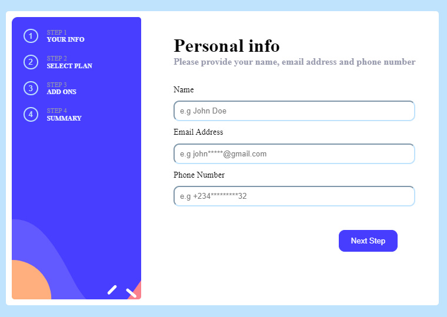
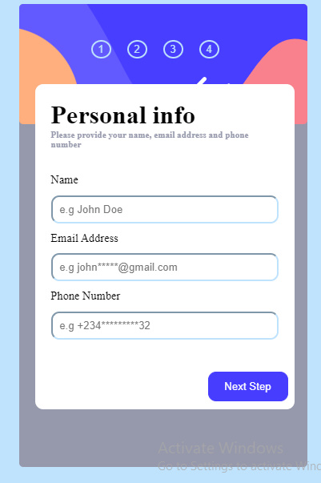

## Week 3: My Third Assignment with Web3Bridge web2 advanced program.

# Project : Multi-step form with Javascript

## Overview

### The challenge

Users should be able to:

- Pick multiple options
- move within pages
- change their choices

### Screenshot

### Links

- Live Site URL: (https://your-live-site-url.com)

## My process

### Built with

- Semantic HTML5 markup
- CSS custom properties
- Flexbox
- Desktop workflow
- Vanilla Javascript

### What I learned

I learnt so much from this project from basic styling to Javascript DOM manipulation, Storing Data with Data Structures like Arrays ad Objects. I got better with dom maniputaion.

### Continued development

I would love to continue development in DOM Manipulation

## Author

- Twitter - [@Affiliate_Hima](https://www.twitter.com/Affiliate_Hima)
